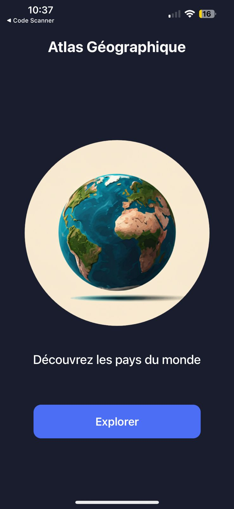
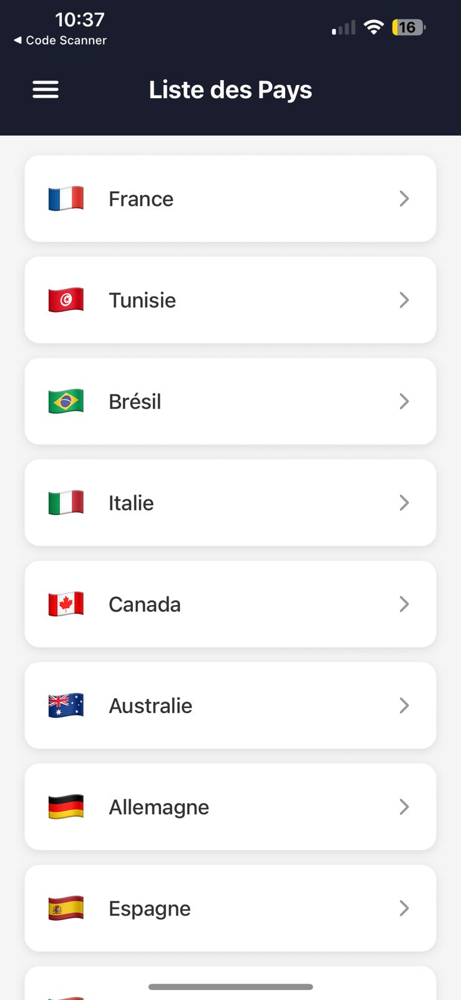
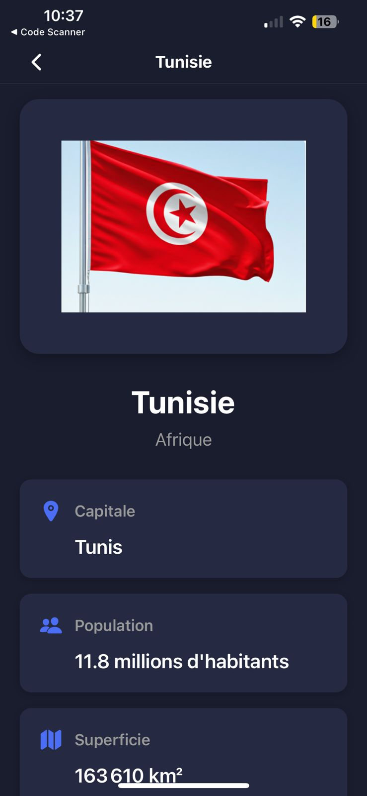
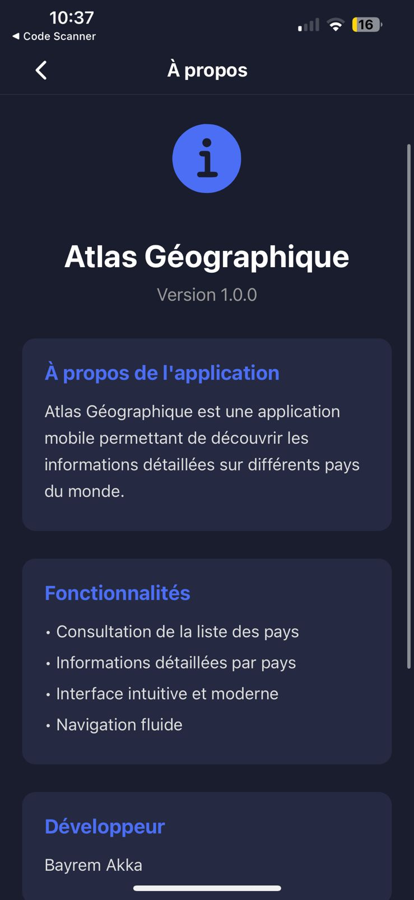

# Atlas Géographique – Expo/React Native (TypeScript)

> Application mobile multi-plateforme (iOS/Android/Web) présentant un atlas interactif des pays du monde. Réalisée avec Expo Router et TypeScript.

## 👀 Aperçu du projet

- Page d’accueil avec image et CTA “Explorer”
- Liste des pays avec tiroir latéral (Drawer)
- Détails d’un pays (capitale, population, superficie, langue)
- Page “À propos”
- Thème sombre cohérent et UI moderne

## 🧭 Parcours utilisateur

1) L’application s’ouvre sur la page d’accueil.
2) Bouton “Explorer” → ouvre la liste des pays.
3) Taper sur un pays → ouvre la page de détails du pays.
4) Ouvrir le menu (hamburger) → Accueil, À propos, Quitter.

## 🧱 Architecture (fichiers clés)

- `app/index.tsx` : Accueil (WelcomePage) – écran initial.
- `app/(tabs)/index.tsx` : Liste des pays + Drawer.
- `app/country/[id].tsx` : Détails d’un pays (route dynamique).
- `app/about.tsx` : Écran “À propos”.
- `app/_layout.tsx` : Stack racine (index, (tabs), about, country/[id]).
- `constants/countries.ts` : Données (interface `Country` + liste de pays).
- `assets/images/` : Images (globe, icônes, drapeaux comme `Tunisia_Big.png`).

## 🗂️ Modèle de données (TypeScript)

```ts
export interface Country {
   id: string;
   name: string;         // nom
   flag: string;         // émoji du drapeau
   flagImage?: any;      // image locale optionnelle
   capital: string;      // capitale
   population: number;   // population (entier)
   area: number;         // superficie en km²
   region: string;       // région
   language: string;     // langue(s)
   currency: string;     // monnaie (bonus)
}
```

- Les données sont définies dans `constants/countries.ts` (ex. France, Tunisie, etc.).
- Formatage appliqué côté détail: population en “X.Y millions d’habitants”, `area` en `fr-FR` avec “km²”.

## 🧩 Fonctionnalités réalisées

- Accueil (image du globe, texte “Découvrez les pays du monde”, bouton “Explorer”).
- Liste des pays (FlatList) avec tuiles cliquables (nom + drapeau).
- Drawer latéral: Accueil (→ `/`), À propos (→ `/about`), Quitter (alerte).
- Détails du pays: titre = nom, grande image/emoji du drapeau, cartes d’infos (capitale, population, superficie, langue).
- En-têtes iOS propres: retour sans libellé parasite.

## 🚀 Lancer le projet

Installer les dépendances puis démarrer Expo:

```bash
npm install
npx expo start
```

Ouvrir sur téléphone avec Expo Go:
- Scanner le QR code affiché dans le terminal.
- iPhone: appareil photo (ou Expo Go) sur le QR code.

Mode hors-ligne (si réseau limité):

```bash
npx expo start --offline
```

Reconstruction propre (vider le cache Metro):

```bash
npx expo start -c
```

Tunnel (si même Wi‑Fi impossible):

```bash
npx expo start --tunnel
```

Astuce réseau (iOS réel): Si le Wi‑Fi d’entreprise bloque, connectez l’ordinateur au **partage de connexion** de l’iPhone, puis relancez `npx expo start`.

## 🧭 Navigation (Expo Router)

- Routage basé sur les fichiers.
- Écran initial: `app/index.tsx` (accueil).
- Accueil → `(tabs)` (liste des pays) via `router.replace('/(tabs)')`.
- Pays → détails via `router.push('/country/:id')`.
- Drawer Accueil → `router.replace('/')`.

## 🎨 UI & Composants

- Icônes: `@expo/vector-icons/Ionicons` (menu, map, people, etc.).
- Styles sobres (fonds `#1a1d2e`, cartes `#252a42`, accent `#4c6ef5`).
- Accessibilité tactile: états `pressed` sur les boutons/Pressable.

## 🧹 Nettoyage effectué

- Page d’accueil réelle utilisée comme `app/index.tsx` (plus de page d’accueil “template Expo”).
- En-têtes de retour sans “(tabs)”.
- Les écrans inutiles du starter sont masqués/remplacés par vos écrans.

## 🔧 Personnalisation rapide

- Ajouter un drapeau image: placer le PNG dans `assets/images/`, puis ajouter `flagImage: require('@/assets/images/MonPays.png')` dans `countries.ts`.
- Modifier l’écran initial: éditer `app/index.tsx`.
- Adapter la palette: voir styles internes des écrans.

## 🖼️ Captures d'écran


Accueil — Écran d’accueil avec le globe et le bouton « Explorer » pour ouvrir la liste des pays.


Liste des pays — Parcourez les pays (FlatList) et touchez une tuile pour voir les détails.


Détail d’un pays — Fiche avec capitale, population, superficie, langue et autres informations clés.


Menu latéral (Drawer) — Accès rapide à Accueil, À propos et Quitter.


À propos — Informations sur l’application et le projet.

## 📁 Arborescence (extrait)

```
app/
   _layout.tsx
   index.tsx                # Accueil
   (tabs)/
      _layout.tsx
      index.tsx             # Liste des pays + Drawer
   country/
      [id].tsx              # Détails d'un pays
   about.tsx               # À propos
assets/images/            # Images (globe, Tunisia_Big.png, ...)
constants/
   countries.ts            # Données et interface Country
```

## ✍️ Auteur

- Bayrem Akka — Projet “atlas_geo_BayremAkka” (Examen Pratique – Développement Mobile Cross-Plateforme).

---

Si vous voulez que je supprime définitivement les fichiers de template restants ou que je bascule toute la navigation en **Stack** (sans dossier `(tabs)`), dites‑le et je le fais dans une passe suivante.
